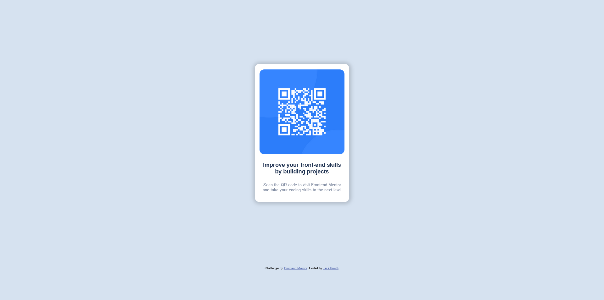

# Frontend Mentor - QR code component solution

This is a solution to the [QR code component challenge on Frontend Mentor](https://www.frontendmentor.io/challenges/qr-code-component-iux_sIO_H). Frontend Mentor challenges help you improve your coding skills by building realistic projects. 

## Table of contents

- [Frontend Mentor - QR code component solution](#frontend-mentor---qr-code-component-solution)
  - [Table of contents](#table-of-contents)
  - [Overview](#overview)
    - [Screenshot](#screenshot)
    - [Links](#links)
  - [My process](#my-process)
    - [Built with](#built-with)
    - [What I learned](#what-i-learned)
    - [Continued development](#continued-development)
    - [Useful resources](#useful-resources)
  - [Author](#author)

## Overview

### Screenshot



### Links

- Solution URL: [Add solution URL here](https://your-solution-url.com)
- Live Site URL: [Add live site URL here](https://your-live-site-url.com)

## My process

### Built with

- Semantic HTML5 markup
- CSS custom properties
- Flexbox
- CSS Grid
- Mobile-first workflow

### What I learned

I learned how to make a card that can be positioned anywhere on the page. I'm used to bootstrap so that was quite a bit different than normal for me. 

```html
<div class="card QR">    
    <div class="card-content">
        <div class="image-container">
            </img>
        </div>
        <h4 id="QrCode-Title">Improve your front-end skills by building projects</h4>
        <p id="QrCode-Body"> Scan the QR code to visit Frontend Mentor and take your coding skills to the next level</p>
    </div>
</div>
```
```css
.card {
    display: flex;
    justify-content: center;
    align-items: center;
    max-width: 300px;
    max-height: 440px;
    height: 100vh;
    border-radius: 15px;
    box-shadow: 1px 1px 10px 6px rgba(0, 0, 0, .15);
    margin: auto auto;
    background-color: #ffffff;
}
```

### Continued development

I'd like to continue learning how to use CSS grid and flexbox, as well as the nuances of getting each div element to do exactly what I want it to.

### Useful resources

- [Mozilla Developer Network](https://developer.mozilla.org/en-US/docs/Web/HTML) - This is an amazing article which helped me finally understand XYZ. I'd recommend it to anyone still learning this concept.
- [Phind](https://www.phind.com) - Helped me understand the nuances of flexboxes and CSS grid.
## Author

- Github - [Jack Smith @Clonephaze](https://www.github.com/Clonephaze)
- Frontend Mentor - [@Clonephaze](https://www.frontendmentor.io/profile/Clonephaze)
- Twitter - [@yourusername](https://www.twitter.com/yourusername)

